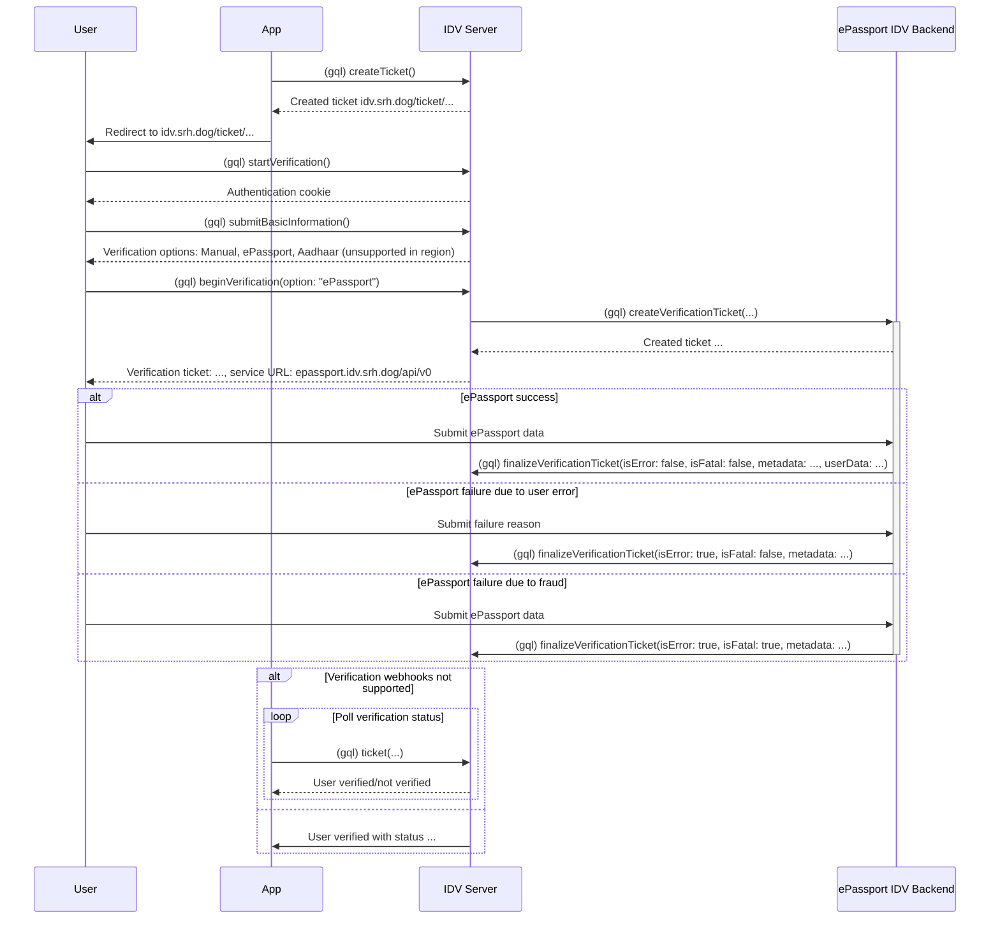

<h1>
    <picture height="64">
        <source
            srcset="idv-logo-light.svg"
            media="(prefers-color-scheme: dark)"
        />
        <source
            srcset="idv-logo-black.svg"
            media="(prefers-color-scheme: light), (prefers-color-scheme: no-preference)"
        />
        
    </picture>
     
    IDV server
</h1>

Check back later.

