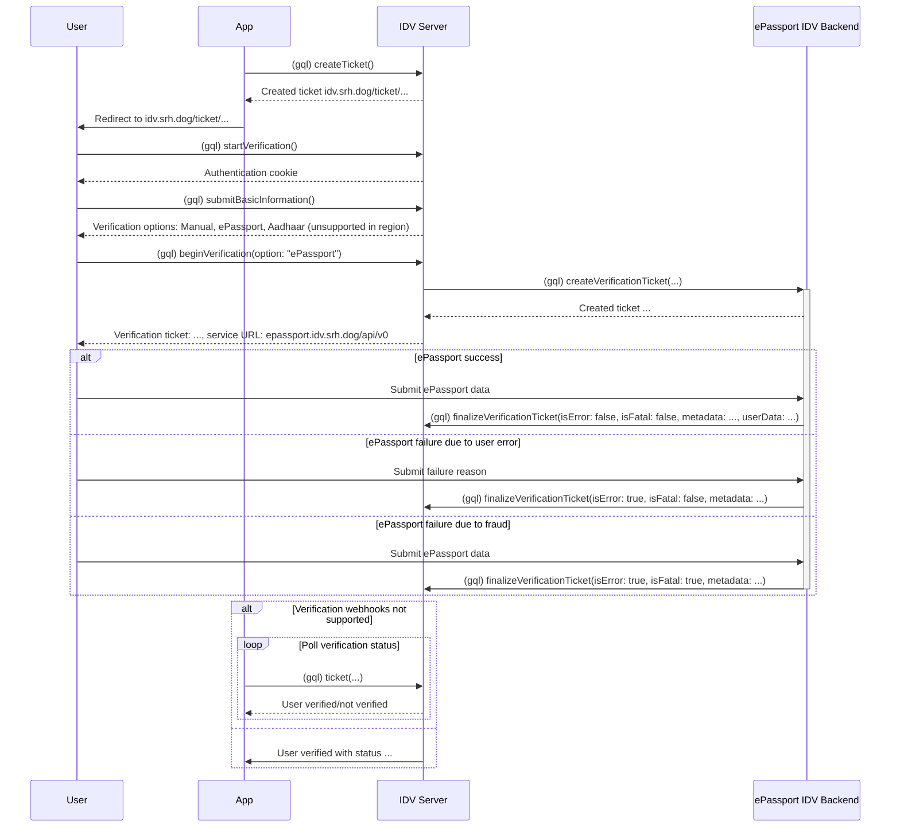

<h1>
    <picture height="64">
        <source
            srcset="idv-logo-light.svg"
            media="(prefers-color-scheme: dark)"
        />
        <source
            srcset="idv-logo-black.svg"
            media="(prefers-color-scheme: light), (prefers-color-scheme: no-preference)"
        />
        
    </picture>
    <br>
    IDV server
</h1>

Check back later.



## Authentication

Authentication is wide and varied, and so it is left up to implementors
of IDV. idv-server is designed to delegate authentication and
authorization to a third-party Policy Decision Point (PDP).

### API

idv-server will forward the headers in `auth_headers` and send a request
to the `auth_pdp_endpoint` to determine whether access should be
allowed.

```
GET /createTicket HTTP/1.1
Authorization: eyXXXXXX
.. other forwarded headers ..
```

idv-server will accept the request if a 200 or 204 is returned, and
reject otherwise.

### Routes

#### Queries

> [!NOTE]
> idv-server will include an `X-Issuer-Id` header, which includes the
> issuer of the ticket.

- `ticket(id: $id)` -> `GET /ticket/$id`
  **Note:** Should be public.

- `ticket(id: $id) { verificationInformation }` -> `GET /ticket/$id/verificationInformation`
  **Note:** Should only be available to the issuer.

#### Mutations

- `createTicket(issuer: $id)` -> `POST /issuer/$id/createTicket`
  **Note:** Should only be available to issuers.
  
> [!NOTE]
> idv-server will include an `X-Issuer-Id` header.
  
- `startBasicVerification(ticket: $id)` -> `POST /ticket/$id/startBasicVerification`
  **Note:** Should be public. idv-server will also verify the
  Authorization header to ensure that it matches the token associated
  with the ticket.

- `submitBasicInformation(ticket: $id)` -> `POST /ticket/$id/submitBasicInformation`
  **Note:** Should be public. idv-server will also verify the
  Authorization header to ensure that it matches the token associated
  with the ticket.

> [!NOTE]
> idv-server will include an `X-Verifier-Id` header.

- `updateVerificationTicket(ticket: $id)` -> `POST /verificationTicket/$id/updateVerificationTicket`
  **Note:** Should only be available to the verifier that the ticket
  was issued to.

- `finalizeVerificationTicket(ticket: $id)` -> `POST /verificationTicket/$id/finalizeVerificationTicket`
  **Note:** Should only be available to the verifier that the ticket
  was issued to.